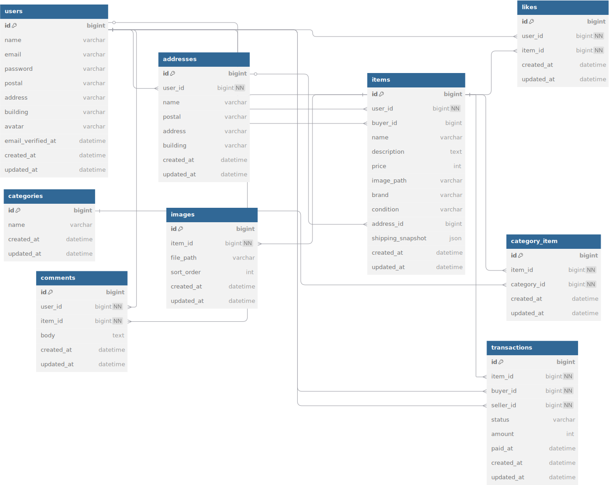

#FREE-MARKET

##環境構築

###Dockerビルド

・git clone git@github.com:coachtech-material/laravel-docker-template.git
・docker-compose up -d --build
・cd free-market
・cp .env.example .env
   .env : DB_CONNECTION=mysql
          DB_CHARSET=utf8mb4
          DB_COLLATION=utf8mb4_unicode_ci
          DB_HOST=mysql
          DB_PORT=3306
          DB_DATABASE=laravel_db
          DB_USERNAME=laravel_user
          DB_PASSWORD=laravel_pass

###Laravel環境構築

・docker-compose exec php bash
・composer install
・php artisan key:generate
・php artisan storage:link
・php artisan migrate
・php artisan db:seed
・php artisan migrate:status

##開発環境

・トップ画面 : http://localhost/
・ユーザー登録画面 : http://localhost/register
・phpMyAdmin : http://localhost:8080/

##使用技術

・PHP : 8.1.33
・Laravel : 8.83.29
・MySQL : 8.0.26
・nginx : 1.21.1

##ER図
